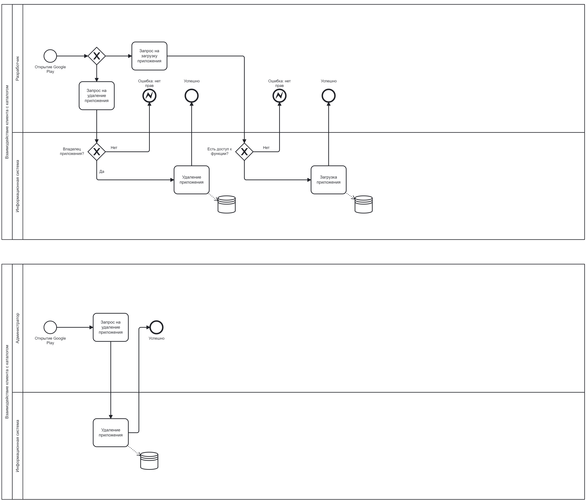
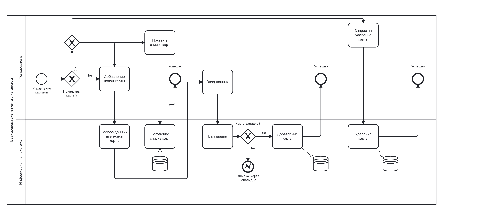
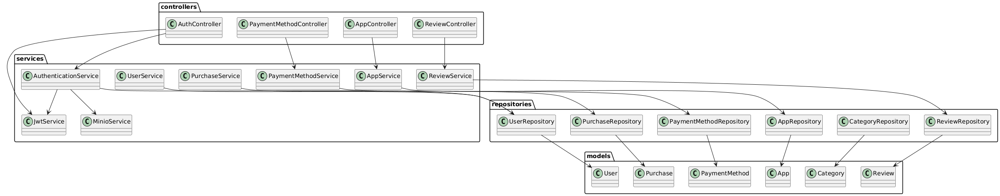
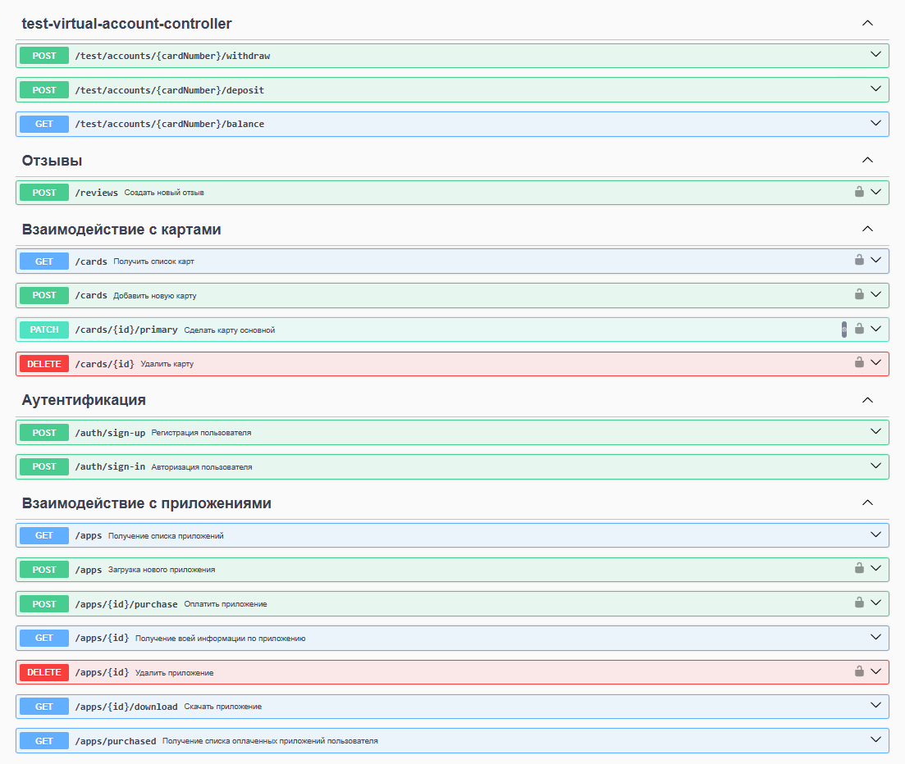

# Бизнес-логика программных систем

## Лабораторная работа №3

Вариант №1234

Google Play — приложения и игры — https://play.google.com. 
Бизнес-процесс: взаимодействие клиента с каталогом — выбор приложения, установка и/или покупка, управление картами и платёжными аккаунтами.

Согласованные задачи:
- Асинхронная работа будет выполняться между основным сервисом и сервисом загрузки/скачивания приложений apk через RabbitMQ;
- Планировщик задач Spring (@Scheduled) будет периодически формировать pdf документы со статистикой загрузки, скачивания приложений, количества оставленных комментариев и другую информацию;
- В качестве внешней корпоративной информационной системы будет использоваться Юкасса для приема платежей;

### Задание:

Доработать приложение из лабораторной работы #2, реализовав в нём асинхронное выполнение задач с распределением бизнес-логики между несколькими вычислительными узлами и выполнением периодических операций с использованием планировщика задач, а также интеграцию с внешней информационной системой.

**Требования к реализации асинхронной обработки:**

1. Перед выполнением работы неободимо согласовать с преподавателем набор прецедентов, в реализации которых целесообразно использование асинхронного распределённого выполнения задач. Если таких прецедентов использования в имеющейся бизнес-процесса нет, нужно согласовать реализацию новых прецедентов, доработав таким образом модель бизнес-процесса из лабораторной работы #1.
2. Асинхронное выполнение задач должно использовать модель доставки "очередь сообщений".
3. В качестве провайдера сервиса асинхронного обмена сообщениями необходимо использовать очередь сообщений на базе RabbitMQ.
4. Для отправки сообщений необходимо использовать протокол AMQP 1.0. Библиотеку для реализации отправки сообщений можно взять любую на выбор студента.
5. Для получения сообщений необходимо использовать JMS API.

**Требования к реализации распределённой обработки:**

1. Обработка сообщений должна осуществляться на двух независимых друг от друга узлах сервера приложений.
2. Если логика сценария распределённой обработки предполагает транзакционность выполняемых операций, они должны быть включены в состав распределённой транзакции.

**Требования к реализации запуска периодических задач по расписанию:**

1. Согласовать с преподавателем прецедент или прецеденты, в рамках которых выглядит целесообразным использовать планировщик задач. Если такие прецеденты отсутствуют -- согласовать с преподавателем новые и добавить их в модель автоматизируемого бизнес-процесса.
2. Реализовать утверждённые прецеденты с использованием планировщика задач Spring (@Scheduled).

**Требования к интеграции с внешней Корпоративной Информационной Системой (EIS):**

1. Корпоративная Информационная Cистема, с которой производится интеграция, а также её функциональные возможности выбираются на усмотрение преподавателя и согласуются с ним.
2. Взаимодействие с внешней Копроративной Информационной Системой должно быть реализовано с помощью технологии JCA (Jakarta Connectors).

**Правила выполнения работы:**

Все изменения, внесённые в реализуемый бизнес-процесс, должны быть учтены в описывающей его модели, REST API и наборе скриптов для тестирования публичных интерфейсов модуля.
Доработанное приложение необходимо либо развернуть на сервере helios, либо продемонстрировать его работоспособность на собственной инфраструктуре обучающегося.

### Выполнение:

**Бизнес процессы:** 




**Диаграмма классов проекта:**


**Набор эндпоинтов для взаимодействия с бекендом:**

Для просмотра более подробного варианта, воспользуйтесь локальной ссылкой:
http://localhost:8080/swagger-ui/index.html#/

Для просмотра содержимого объектного хранилища Minio, воспользуйтесь локальной ссылкой:
http://localhost:9090/
```
username: admin
password: 12345678
```

**Локальный запуск проекта:** 
```
gradle clean build

docker-compose up
# или если уже есть образ бекенда
docker-compose -f docker-compose.prod.yml up
```

**Запуск проекта на сервере:**
```
# На локальной машине
gradle clean build
docker-compose build backend
docker save -o backend.tar lab1-backend
scp backend.tar docker-compose.prod.yml user@ip:/home/

# На сервере 
# Установка Docker
sudo apt-get update
sudo apt-get install -y apt-transport-https ca-certificates curl software-properties-common
curl -fsSL https://download.docker.com/linux/ubuntu/gpg | sudo apt-key add -
sudo add-apt-repository "deb [arch=amd64] https://download.docker.com/linux/ubuntu $(lsb_release -cs) stable"
sudo apt-get update
sudo apt-get install -y docker-ce docker-ce-cli containerd.io
# Установка Docker Compose
sudo curl -L "https://github.com/docker/compose/releases/download/v2.23.0/docker-compose-$(uname -s)-$(uname -m)" -o /usr/local/bin/docker-compose
sudo chmod +x /usr/local/bin/docker-compose
# Добавление пользователя в группу docker
sudo usermod -aG docker $USER
newgrp docker  # Применяем изменения группы без перезагрузки

# Загрузка образа
docker load -i /home/user/backend.tar

# Запуск
docker-compose -f docker-compose.prod.yml up
```
Дальнейшее обращение к эндпоинтам осуществляется по http://server-ip:8080/ вместо http://localhost:8080/

### Вывод:
В ходе выполнения лабораторной работы получен опыт в реализации программного управления транзакциями с помощью Spring JTA, Atomikos. Помимо этого получен опыт в разграничении доступа по привилегиям.