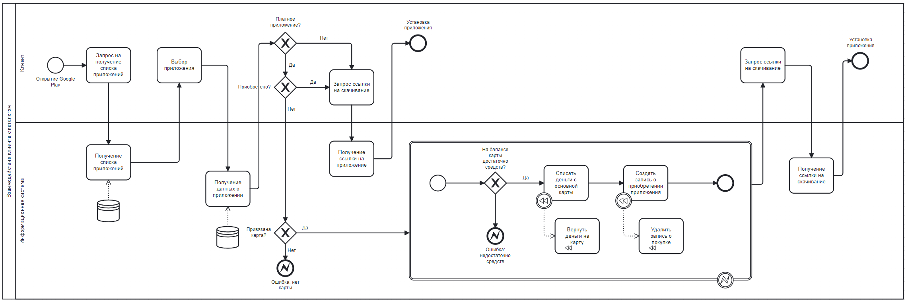

# Бизнес-логика программных систем

## Лабораторная работа №2

Вариант №323

Google Play — приложения и игры — https://play.google.com. 
Бизнес-процесс: взаимодействие клиента с каталогом — выбор приложения, установка и/или покупка, управление картами и платёжными аккаунтами.

### Задание:

Доработать приложение из лабораторной работы #1, реализовав в нём управление транзакциями и разграничение доступа к операциям бизнес-логики в соответствии с заданной политикой доступа.

**Управление транзакциями необходимо реализовать следующим образом:**

1. Переработать согласованные с преподавателем прецеденты (или по согласованию с ним разработать новые), объединив взаимозависимые операции в рамках транзакций.
2. Управление транзакциями необходимо реализовать с помощью Spring JTA.
3. В реализованных (или модифицированных) прецедентах необходимо использовать программное управление транзакциями.
4. В качестве менеджера транзакций необходимо использовать Atomikos.

**Разграничение доступа к операциям необходимо реализовать следующим образом:**

1. Разработать, специфицировать и согласовать с преподавателем набор привилегий, в соответствии с которыми будет разграничиваться доступ к операциям.
2. Специфицировать и согласовать с преподавателем набор ролей, осуществляющих доступ к операциям бизнес-логики приложения.
3. Реализовать разработанную модель разграничений доступа к операциям бизнес-логики на базе Spring Security. Информацию об учётных записах пользователей необходимо сохранять в файле XML, для аутентификации использовать JWT.

**Правила выполнения работы:**

1. Все изменения, внесённые в реализуемый бизнес-процесс, должны быть учтены в описывающей его модели, REST API и наборе скриптов для тестирования публичных интерфейсов модуля.
2. Доработанное приложение необходимо развернуть на сервере helios.

### Выполнение:

**Бизнес процессы:** 



**Диаграмма классов проекта:**


**Набор эндпоинтов для взаимодействия с бекендом:**

Для просмотра более подробного варианта, воспользуйтесь локальной ссылкой:
http://localhost:8080/swagger-ui/index.html#/

Для просмотра содержимого объектного хранилища Minio, воспользуйтесь локальной ссылкой:
http://localhost:9090/
```
username: admin
password: 12345678
```

**Локальный запуск проекта:** 
```
gradle clean build

docker-compose up
# или если уже есть образ бекенда
docker-compose -f docker-compose.prod.yml up
```

**Запуск проекта на сервере:**
```
# На локальной машине
gradle clean build
docker-compose build backend
docker save -o backend.tar lab1-backend
scp backend.tar docker-compose.prod.yml user@ip:/home/

# На сервере 
# Установка Docker
sudo apt-get update
sudo apt-get install -y apt-transport-https ca-certificates curl software-properties-common
curl -fsSL https://download.docker.com/linux/ubuntu/gpg | sudo apt-key add -
sudo add-apt-repository "deb [arch=amd64] https://download.docker.com/linux/ubuntu $(lsb_release -cs) stable"
sudo apt-get update
sudo apt-get install -y docker-ce docker-ce-cli containerd.io
# Установка Docker Compose
sudo curl -L "https://github.com/docker/compose/releases/download/v2.23.0/docker-compose-$(uname -s)-$(uname -m)" -o /usr/local/bin/docker-compose
sudo chmod +x /usr/local/bin/docker-compose
# Добавление пользователя в группу docker
sudo usermod -aG docker $USER
newgrp docker  # Применяем изменения группы без перезагрузки

# Загрузка образа
docker load -i /home/user/backend.tar

# Запуск
docker-compose -f docker-compose.prod.yml up
```
Дальнейшее обращение к эндпоинтам осуществляется по http://server-ip:8080/ вместо http://localhost:8080/

### Вывод:
В ходе выполнения лабораторной работы получен опыт в реализации программного управления транзакциями с помощью Spring JTA, Atomikos. Помимо этого получен опыт в разграничении доступа по привилегиям.